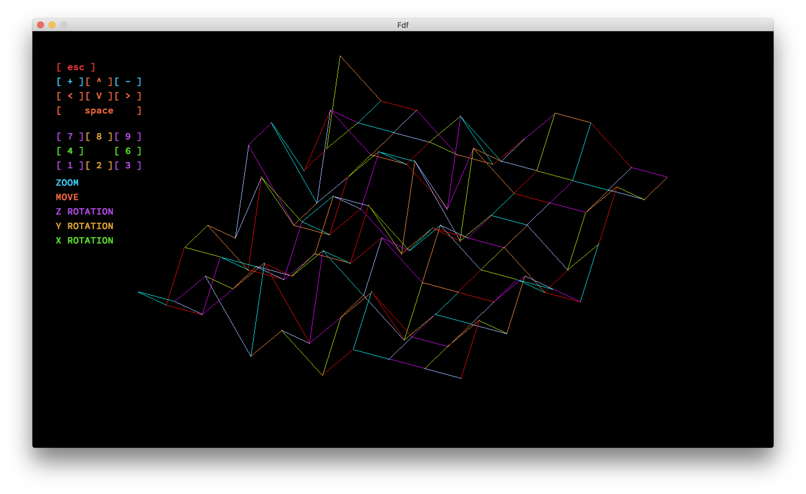
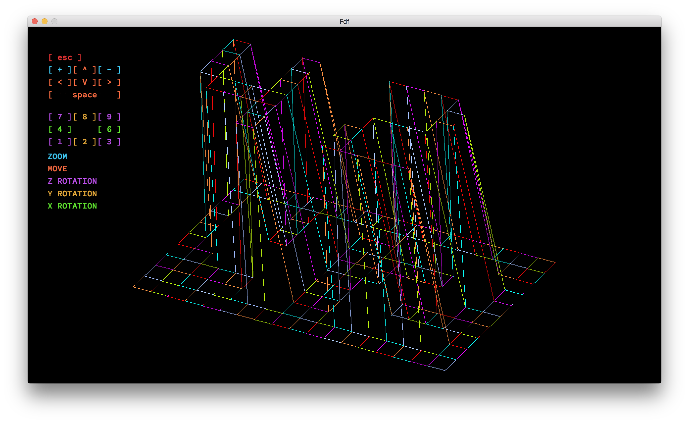

# Fdf
First graphic project of 42School

<h3>Several options:</h3>
- Rotation (x, y, z axises). 
- Move. 
- Zome.
 
<h3>Install & launch:</h3>
- git clone https://github.com/pavelrosh/Fdf ~/Fdf  
- cd ~/FdF  
- make  
- put a parameter to binary file(fdf) like "./fdf maps/42.fdf"
